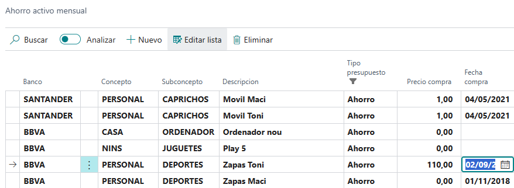
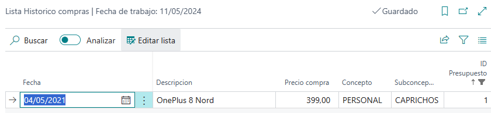

## Presupuestar nuevo gasto

Para empezar vamos a ir a la lista de compras presupuestadas (**Ahorro activo mensual**):

Crearemos un nuevo registro con la siguiente informacion:

  - **Banco**: Escoger la ficha de banco de la que se va a descontar el coste de este nuevo presupuesto.
  - **Concepto**/**SubConcepto**: Escoger el concepto y subconcepto al que vamos a imputar el coste del presupuesto. 
  - **Descripcion**: Texto libre que ira en los asientos del gasto
  - **Tipo ahorro**: Las lineas creadas en esta consulta se crearán como Ahorro para distinguir de los gastos periodicos.
  - **Importe mensual**: Importe que se irá acumulando cada mes.
  - **Importe objetivo**: Precio objetivo de compra.
  - **Caducado**: Si por algún motivo queremos que un presupuesto deje de acumularse, pero no lo queremos borrar, lo podemos marcar como Caducado.

### Seguimiento del presupuesto

A continuación vamos a revisar los campos que permiten dar seguimiento a cada uno de los presupuestos:

  - **Ahorro acumulado**: Suma de lo acumulado hasta el momento.
  - **Meses ahorrados (Real)**: Meses transcurridos desde la creación del presupuesto.
  - **Meses de ahorro**: Es la división del ahorra acumulado entre el importe mensual. Para aquellos casos en que se haya manipulado el Ahorro acumulado o se pueda haber cambiado el importe mensual. 
  - **Fecha ult. operacion**: Refleja la última vez que se ha ejecutado el proceso automatico de creación de asiento de coste presupuestado.

### Registrar la compra

Cuando se compra el gadget/objetivo se puede reflejar la fecha y el precio de compra para guardar un histórico, en caso de que se compre periodicamente, como puede ser un teléfono, una pala, etc.

En primer lugar tenemos que rellenar el precio de compra y después la fecha de compra, cuando se rellene la fecha se va a crear un registro de histórico de compras. Este histórico se puede ver mediante la opción **Historico de compras** que hay en el Ribbon:

   